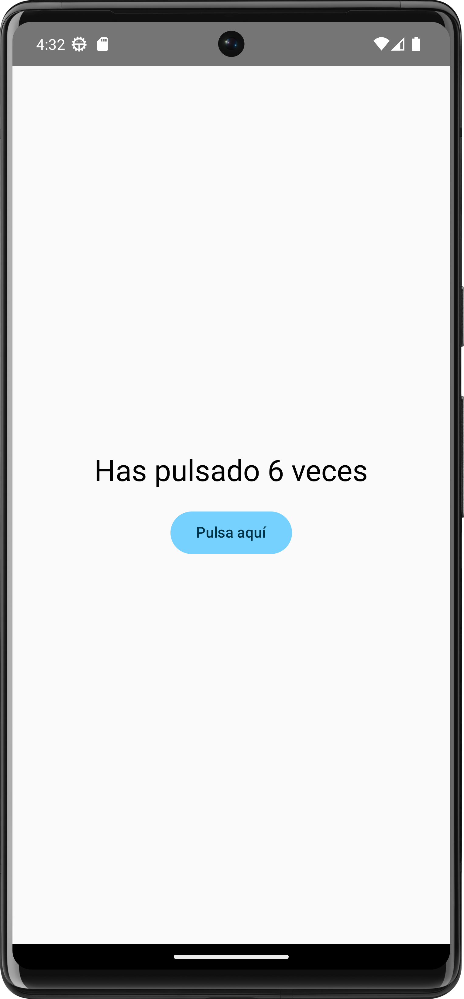

# 📱 Contador de Clics – Demostración de estado en Jetpack Compose

Una aplicación simple para demostrar el concepto de **estado** y las mejores prácticas para su gestión en Android con **Jetpack Compose**.  

Este proyecto sirve como mini–laboratorio para comprender:

- Composición de UI sin estado (*stateless*) con `@Composable`.  
- Elevación de estado (*State Hoisting*).  
- Separación de la lógica del negocio de la UI.  
- Pruebas unitarias y de integración para un código mantenible.  

Ideal para **docentes y estudiantes**: es un ejemplo corto, bien estructurado y comentado para introducir los fundamentos de Compose.

---

## 📷 Vistas principales de la app

<p align="center">
  
  
</p>

---

## 🚀 Características principales

- Contador con texto que se actualiza al presionar el botón.  
- Lógica de conteo separada en una función auxiliar.  
- Diseño centrado y minimalista con `Column`, `Text` y `Button`.  
- Paleta de color **Material 3**.  

---

## 🧩 Estructura de componentes

- **`CounterAppWithLogic()`** → contenedor principal; eleva el estado y maneja la lógica.  
- **`CounterScreenStateless()`** → componente de UI *tonto*; muestra el estado y llama a la acción de incremento.  
- **`increment()`** → función auxiliar que contiene la lógica de negocio.  

---

## 🧠 Tecnologías utilizadas

- Kotlin  
- Jetpack Compose  
- Material 3  
- Android Studio / Gradle  
- JUnit 4 (para pruebas unitarias)  
- Compose Test (para pruebas de integración)  

---

## ⚙️ Requisitos

- Android Studio **Ladybug** o superior.  
- Gradle y Kotlin actualizados (según tu instalación).  

---

## 🛠️ Cómo ejecutar el proyecto

1. Clona el repositorio:

```bash
git clone https://github.com/alejing/contador-clics-app.git
 ```
2. Abre el proyecto en Android Studio.
3. Sincroniza Gradle.
4. Ejecuta la aplicación en un emulador o dispositivo.
5. Para correr las pruebas, abre `src/test/java` y `src/androidTest/java` y ejecútalas desde el IDE o con Gradle.

---

## 📚 Propósito educativo
- Diferenciar componentes sin estado y su ventaja para probar y reutilizar.
- Aplicar modificadores (`Modifier.fillMaxSize`) y diseño de caja (`Column`).
- Entender la importancia de las pruebas automatizadas para una arquitectura limpia.
- Previsualizar el componente con `@Preview`.

---

## 👨‍🏫 Autor y licencia
Proyecto desarrollado por **José Alejandro Franco Calderon** para fines educativos.  
Licencia: MIT

---
